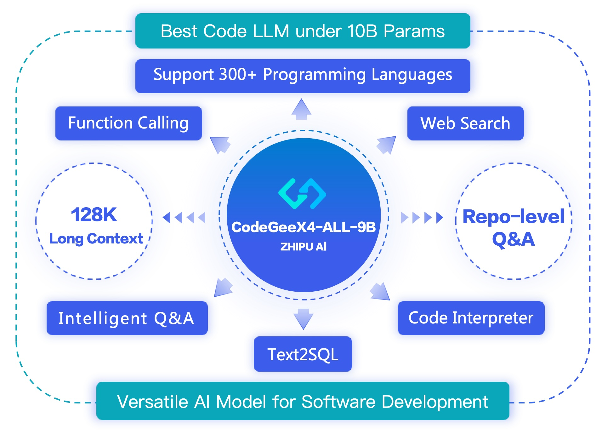
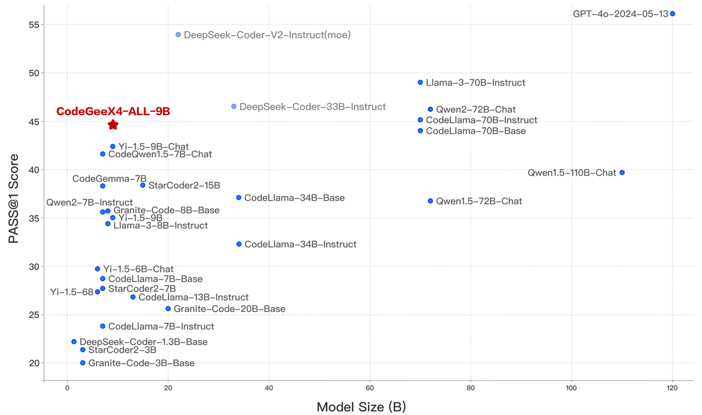
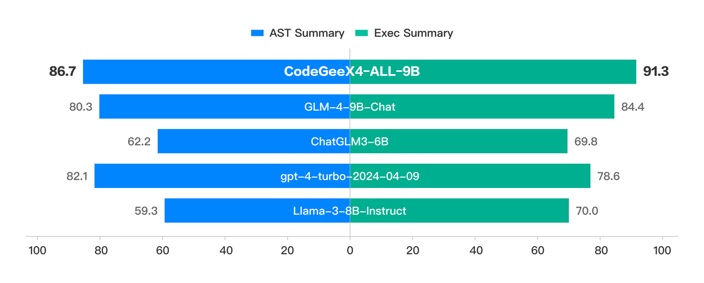
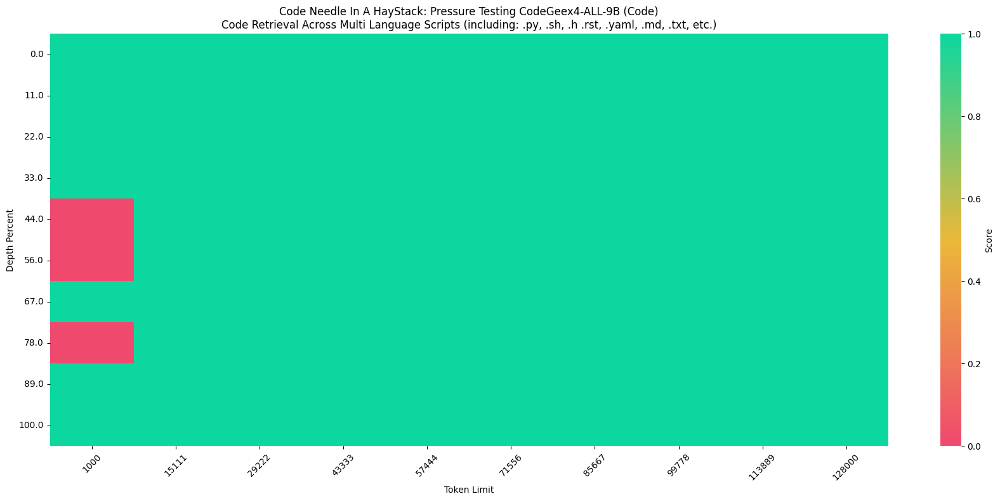

<p align="center">
    🏠 <a href="https://codegeex.cn" target="_blank">Homepage</a>｜🛠 Extensions <a href="https://marketplace.visualstudio.com/items?itemName=aminer.codegeex" target="_blank">VS Code</a>, <a href="https://plugins.jetbrains.com/plugin/20587-codegeex" target="_blank">Jetbrains</a>｜🤗 <a href="https://huggingface.co/THUDM/codegeex4-all-9b" target="_blank">HF Repo</a> | 🪧 <a href="https://huggingface.co/spaces/THUDM/CodeGeeX" target="_blank">HF DEMO</a>
</p>

[English](./README.md) | [中文](./README_zh.md)

# CodeGeeX4: 开源多语言代码生成模型

我们推出了 CodeGeeX4-ALL-9B，这是最新的 CodeGeeX4 系列模型的开源版本。该模型是在 [GLM-4-9B](https://github.com/THUDM/GLM-4) 基础上持续训练的多语言代码生成模型，显著提升了代码生成能力。使用单个 CodeGeeX4-ALL-9B 模型，可以支持代码补全与生成、代码解释、联网搜索、函数调用、仓库级代码问答等多种功能，覆盖了软件开发的各个场景。CodeGeeX4-ALL-9B 在 [BigCodeBench](https://huggingface.co/datasets/bigcode/bigcodebench) 和 [NaturalCodeBench](https://github.com/THUDM/NaturalCodeBench) 等公开基准测试中取得了极具竞争力的表现。它是目前参数量少于 100 亿的最强代码生成模型，甚至超越了更大的通用模型，在推理速度和模型性能方面达到了最佳平衡。

## 模型列表

| 模型             | 类型 | 上下文长度 | 下载地址                                                                                                                                                                                                    |
|-------------------|------|------------|-------------------------------------------------------------------------------------------------------------------------------------------------------------------------------------------------------------|
| codegeex4-all-9b  | Chat | 128K       | [🤗 Huggingface](https://huggingface.co/THUDM/codegeex4-all-9b) [🤖 ModelScope](https://modelscope.cn/models/ZhipuAI/codegeex4-all-9b) [🟣 WiseModel](https://wisemodel.cn/models/ZhipuAI/codegeex4-all-9b)    |

## 快速开始

请使用 `4.39.0<=transformers<=4.40.2` 部署 [codegeex4-all-9b](https://huggingface.co/THUDM/codegeex4-all-9b)：

```python
from transformers import AutoTokenizer, AutoModelForCausalLM

device = "cuda" if torch.cuda.is_available() else "cpu"
tokenizer = AutoTokenizer.from_pretrained("THUDM/codegeex4-all-9b", trust_remote_code=True)
model = AutoModelForCausalLM.from_pretrained(
    "THUDM/codegeex4-all-9b",
    torch_dtype=torch.bfloat16,
    low_cpu_mem_usage=True,
    trust_remote_code=True
).to(device).eval()
inputs = tokenizer.apply_chat_template([{"role": "user", "content": "write a quick sort"}], add_generation_prompt=True, tokenize=True, return_tensors="pt", return_dict=True).to(device)
with torch.no_grad():
    outputs = model.generate(**inputs)
    outputs = outputs[:, inputs['input_ids'].shape[1]:]
    print(tokenizer.decode(outputs[0], skip_special_tokens=True))
```
使用 `vllm==0.5.1` 快速启动 [codegeex4-all-9b](https://huggingface.co/THUDM/codegeex4-all-9b)：

```python
from transformers import AutoTokenizer
from vllm import LLM, SamplingParams

# CodeGeeX4-ALL-9B
# max_model_len, tp_size = 1048576, 4
# 如果出现内存不足（OOM），减少max_model_len，或增加tp_size
max_model_len, tp_size = 131072, 1
model_name = "codegeex4-all-9b"
prompt = [{"role": "user", "content": "Hello"}]

tokenizer = AutoTokenizer.from_pretrained(model_name, trust_remote_code=True)
llm = LLM(
    model=model_name,
    tensor_parallel_size=tp_size,
    max_model_len=max_model_len,
    trust_remote_code=True,
    enforce_eager=True,
    # 如果出现OOM，尝试使用以下参数
    # enable_chunked_prefill=True,
    # max_num_batched_tokens=8192
)
stop_token_ids = [151329, 151336, 151338]
sampling_params = SamplingParams(temperature=0.95, max_tokens=1024, stop_token_ids=stop_token_ids)

inputs = tokenizer.apply_chat_template(prompt, tokenize=False, add_generation_prompt=True)
outputs = llm.generate(prompts=inputs, sampling_params=sampling_params)

print(outputs[0].outputs[0].text)
```

通过 vllm 设置 OpenAI 兼容服务，详细信息请查看 [OpenAI 兼容服务器](https://docs.vllm.ai/en/latest/serving/openai_compatible_server.html)：

```bash
python -m vllm.entrypoints.openai.api_server \
     --model THUDM/codegeex4-all-9b \
     --trust_remote_code
```

## 用户指南
我们为 CodeGeeX4-ALL-9B 提供了用户指南，帮助用户快速了解和使用该模型：



1. **[系统提示指南](./guides/System_prompt_guideline_zh.md)**：本指南介绍了如何在 CodeGeeX4-ALL-9B 中使用系统提示，包括 VSCode 插件的官方系统提示、自定义系统提示以及维护多轮对话历史的一些技巧。

2. **[上下文补全指南](./guides/Infilling_guideline_zh.md)**：本指南解释了 VSCode 插件的官方填充格式，涵盖一般补全、跨文件补全和在仓库中生成新文件。

3. **[项目级代码生成指南](./guides/Repository_tasks_guideline_zh.md)**：本指南展示了如何在 CodeGeeX4-ALL-9B 中使用项目级任务，包括项目级别的问答任务，以及如何触发 CodeGeeX4-ALL-9B 的 aicommiter 功能以执行仓库级别任务中的删除、添加和更改文件操作。

这些指南旨在帮助大家全面理解模型的用法并更好发挥模型的能力。

## 评测指标

CodeGeeX4-ALL-9B 被评为参数量100 亿内的最强模型，甚至超越了参数量大几倍的通用模型，在推理性能和模型能力之间达到了最佳效果。

| **模型**                   | **序列长度** | **HumanEval** | **MBPP** | **NCB** | **LCB** | **HumanEvalFIM** | **CRUXEval-O** |
|-----------------------------|----------------|---------------|----------|---------|---------|------------------|----------------|
| Llama3-70B-intruct          | 8K             | 77.4          | 82.3     | 37.0    | 27.4    | -                | -              |
| DeepSeek Coder 33B Instruct | 16K            | 81.1          | 80.4     | 39.3    | 29.3    | 78.2             | 49.9           |
| Codestral-22B               | 32K            | 81.1          | 78.2     | 46.0    | 35.3    | 91.6             | 51.3           |
| CodeGeeX4-All-9B            | 128K           | 82.3          | 75.7     | 40.4    | 28.5    | 85.0             | 47.1           |

在 BigCodeBench 的 complete 和 instruct 任务中，CodeGeeX4-ALL-9B 分别取得了 `48.9` 和 `40.4` 的高分，这在参数量 200 亿内的模型中是最高的分数。

Crux-Eval 是测试代码推理、理解和执行能力的基准测试，借助于其强大的 COT 能力，CodeGeeX4-ALL-9B 展现出色的表现。在 HumanEval、MBPP 和 NaturalCodeBench 等代码生成任务中，CodeGeeX4-ALL-9B 也取得了出色的成绩。目前，它是唯一支持 Function Call 功能的代码模型，甚至取得了比 GPT-4 更高的分数。

此外，在“Code Needle In A Haystack” (NIAH) 评估中，CodeGeeX4-ALL-9B 模型展示了在 128K 范围内检索代码的能力，在python语言环境达到了 100% 的检索准确率，并在跨文件补全任务中表现出色。
<p align="center">
  
  
</p>

更详细的评估结果请看 **[评估结果](./metric/README_zh.md)** 。


## 许可证

本仓库中的代码是根据 [Apache-2.0](https://www.apache.org/licenses/LICENSE-2.0) 许可证开源的。模型权重根据 [模型许可证](MODEL_LICENSE) 许可。CodeGeeX4-9B 权重对学术研究开放。对于希望将模型用于商业目的的用户，请填写 [登记表](https://bigmodel.cn/mla/form?mcode=CodeGeeX4-ALL-9B)。


## 引用

如果您觉得我们的工作对您有帮助，欢迎引用以下论文：

```bibtex
@inproceedings{zheng2023codegeex,
      title={CodeGeeX: A Pre-Trained Model for Code Generation with Multilingual Evaluations on HumanEval-X},
      author={Qinkai Zheng and Xiao Xia and Xu Zou and Yuxiao Dong and Shan Wang and Yufei Xue and Zihan Wang and Lei Shen and Andi Wang and Yang Li and Teng Su and Zhilin Yang and Jie Tang},
      booktitle={KDD},
      year={2023}
}
```
