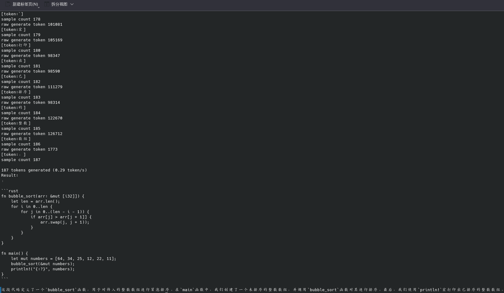

[English](./README.md) | [中文](./README_zh.md)
# CPU运行
```
cargo run --release -- --prompt your prompt
```

# 使用
``` shell
Codegeex4

Usage: codegeex4-candle [OPTIONS] --prompt <PROMPT>

Options:
  -c, --cache <cache>
          Run on CPU rather than on GPU [default: .]
      --cpu
          
      --verbose-prompt
          Display the token for the specified prompt
      --prompt <PROMPT>
          
      --temperature <TEMPERATURE>
          The temperature used to generate samples
      --top-p <TOP_P>
          Nucleus sampling probability cutoff
      --seed <SEED>
          The seed to use when generating random samples [default: 299792458]
  -n, --sample-len <SAMPLE_LEN>
          The length of the sample to generate (in tokens) [default: 5000]
      --model-id <MODEL_ID>
          
      --revision <REVISION>
          
      --weight-file <WEIGHT_FILE>
          
      --tokenizer <TOKENIZER>
          
      --repeat-penalty <REPEAT_PENALTY>
          Penalty to be applied for repeating tokens, 1. means no penalty [default: 1.1]
      --repeat-last-n <REPEAT_LAST_N>
          The context size to consider for the repeat penalty [default: 64]
  -h, --help
          Print help
  -V, --version
          Print version
```
# Cuda运行
- 注意 需要cuda为>=12.4以上的版本
```
cargo build --release --features cuda
./target/release/codegeex4-candle --prompt your prompt
```

