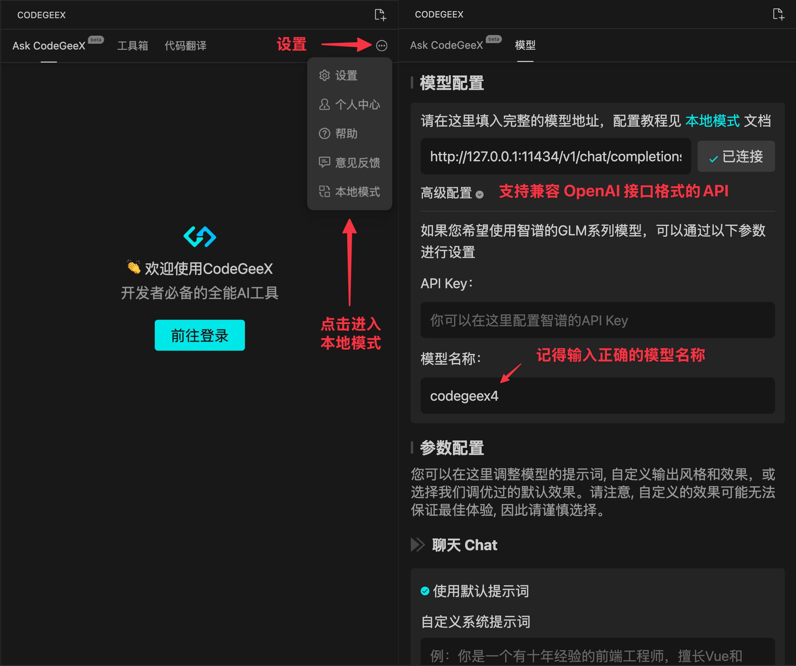

# 本地模式教程: 本地部署并接入 Visual Studio Code / Jetbrains 插件

两个平台的步骤相同。
1. 点击 [VS Code](https://marketplace.visualstudio.com/items?itemName=aminer.codegeex) / [Jetbrains](https://plugins.jetbrains.com/plugin/20587-codegeex) 下载插件。
2. 在插件设置中打开本地模式（无需登录）。
3. 使用以下命令启动 Ollama 服务器（支持其他兼容 OpenAI 格式的 API）：

    ```bash
    export OLLAMA_ORIGINS="*"
    ollama run codegeex4
    ollama serve
    ```
4. 在本地模式设置中输入 api 地址和模型名称。然后享受 CodeGeeX4 的编码体验！

    
