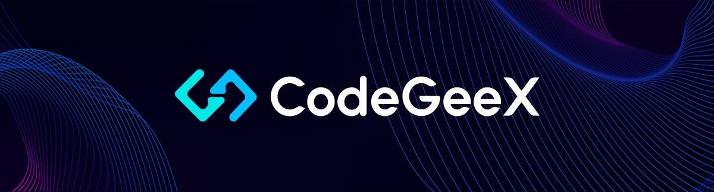
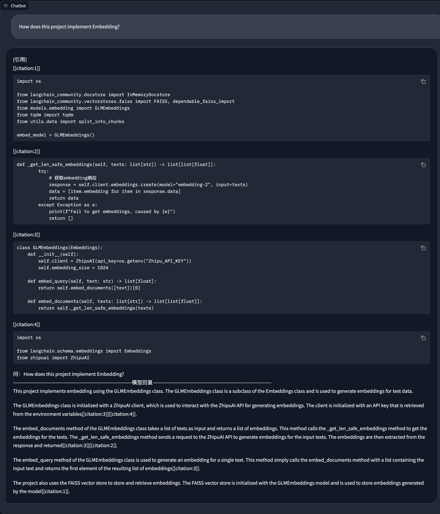

[English](README.md) | [中文](README_zh.md)

## RAG Functionality

CodeGeeX4 supports RAG functionality and is compatible with the Langchain framework to achieve project-level retrieval Q&A.

## Tutorial

### 1. Install Dependencies

Navigate to the `langchain_demo` directory and install the required packages.
```bash
cd langchain_demo
pip install -r requirements.txt
```

### 2. Configure Embedding API Key

This project uses the Embedding API from the Zhipu Open Platform for vectorization. Please register and obtain an API Key first.
Then, configure the API Key in `models/embedding.py`.
For more details, refer to https://open.bigmodel.cn/dev/api#text_embedding.

### 3. Generate Vector Data

```bash
python vectorize.py --workspace . --output_path vectors
>>> File vectorization completed, saved to vectors
```

### 4. Run the Q&A Script

```bash
python chat.py --vector_path vectors
>>> Running on local URL:  http://127.0.0.1:8080
```

## Demo
