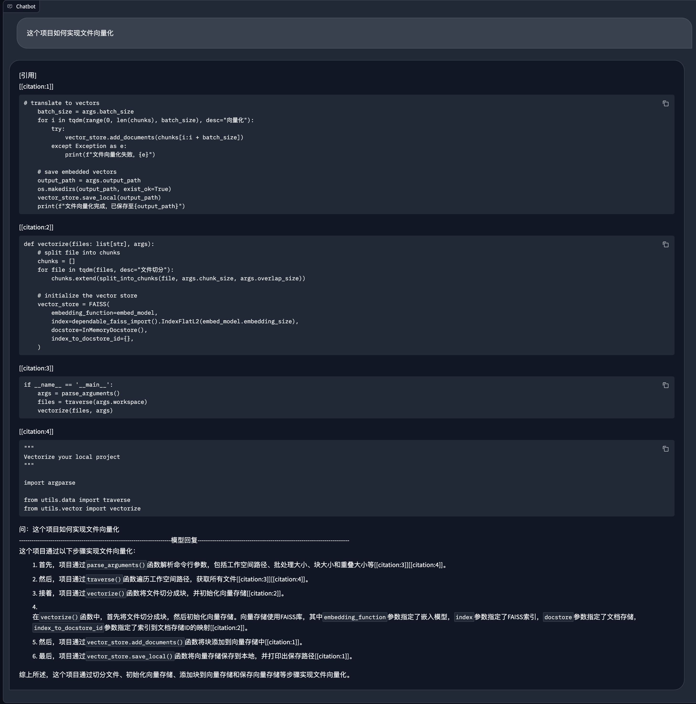

[English](README.md) | [中文](README_zh.md)

## RAG功能

CodeGeeX4支持RAG检索增强，并兼容Langchain框架，实现项目级检索问答。

## 使用教程

### 1. 安装依赖项

```bash
cd langchain_demo
pip install -r requirements.txt
```

### 2. 配置Embedding API Key

本项目使用智谱开放平台的Embedding API实现向量化功能，请先注册并获取API Key。

并在`models/embedding.py`中配置API Key。

详情可参考 https://open.bigmodel.cn/dev/api#text_embedding

### 3. 生成向量数据

```bash
python vectorize.py --workspace . --output_path vectors

>>> 文件向量化完成,已保存至vectors
```

### 4. 运行问答脚本

```bash
python chat.py --vector_path vectors

>>> Running on local URL:  http://127.0.0.1:8080
```

## Demo

