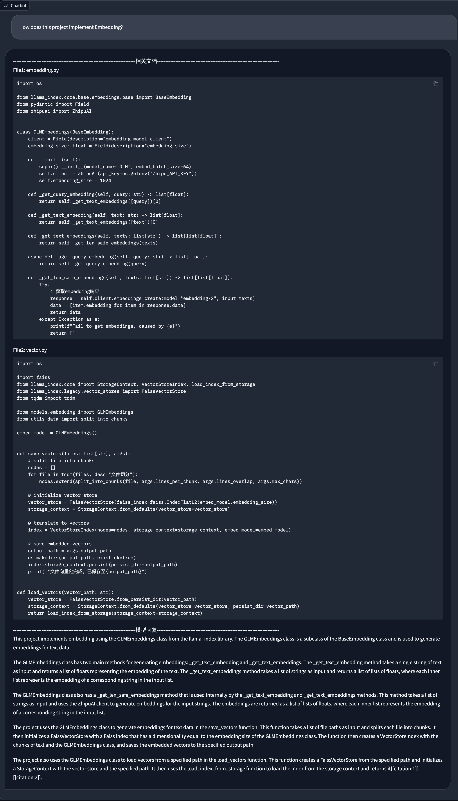

[English](README.md) | [中文](README_zh.md)

## RAG Functionality

CodeGeeX4 supports RAG retrieval enhancement and is compatible with the LlamaIndex framework to achieving project-level retrieval Q&A.

## Usage Tutorial

### 1. Install Dependencies

```bash
cd llamaindex_demo
pip install -r requirements.txt
```

Note: This project uses tree-sitter-language, which has compatibility issues with Python 3.10, so please use Python 3.8 or Python 3.9 to run
this project.

### 2. Configure Embedding API Key

This project uses the Zhipu Open Platform's Embedding API to implement vectorization. Please register and obtain an API Key first.
Then configure the API Key in `models/embedding.py`.
For details, refer to https://open.bigmodel.cn/dev/api#text_embedding

### 3. Generate Vector Data

```bash
python vectorize.py --workspace . --output_path vectors
>>> File vectorization completed, saved to vectors
```

### 4. Run the Q&A Script

```bash
python chat.py --vector_path vectors
>>> Running on local URL: http://127.0.0.1:8080
```

## Demo

