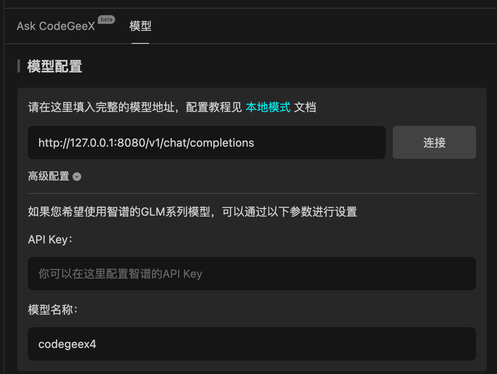

[English](README.md) | [中文](README_zh.md)

## Local Mode

The new version of the CodeGeeX plugin **supports offline mode**, allowing the use of offline deployed models to complete automatic
completion and simple conversation functions.

## Usage Tutorial

### 1. Install Dependencies

```bash
cd local_mode
pip install -r requirements.txt
```

### 2. Run the Project

```bash
python main.py --model_name_or_path THUDM/codegeex4-all-9b --device cuda --bf16 true
>>> Running on local URL:  http://127.0.0.1:8080
```

### 3. Set API Address and Model Name

As shown in the figure below, after opening the plugin with the local mode, enter the API address and model name in the settings.


### 4. Start Using

Click 'Connect' to test, or click 'Ask CodeGeeX' to start using.

## Demo

