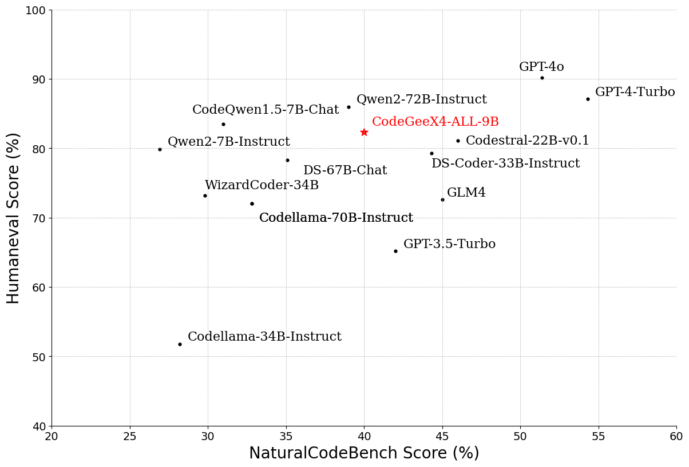
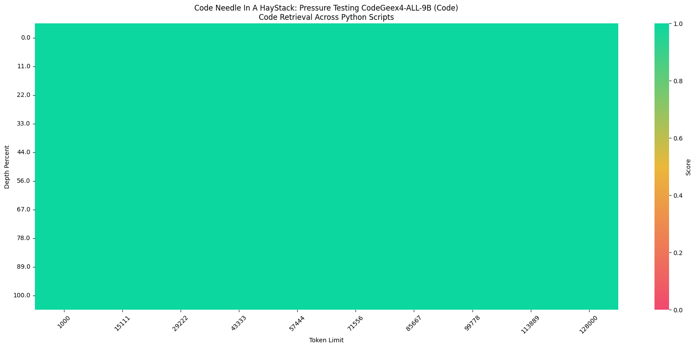

# CodeGeeX4-ALL-9B

## CodeGeeX4-ALL-9B：百亿参数以下性能最强的全能代码模型

CodeGeeX4-ALL-9B作为最新一代CodeGeeX4系列模型的开源版本，在GLM4强大语言能力的基础上继续迭代，大幅增强代码生成能力。使用CodeGeeX4-ALL-9B单一模型，即可支持代码补全和生成、代码解释器、联网搜索、工具调用、仓库级长代码问答及生成等全面功能，覆盖了编程开发的各种场景。CodeGeeX4-ALL-9B在多个权威代码能力评测集，如NaturalCodeBench、BigCodeBench上都取得了极具竞争力的表现，是百亿参数量级以下性能最强的模型，甚至超过数倍规模的通用模型，在推理性能和模型效果上得到最佳平衡。

### 1. 性能表现评测

BigCodeBench测试结果显示，CodeGeeX4-ALL-9B在同等尺寸下效果最好：

NaturalCodeBench测试结果显示，CodeGeeX4-ALL-9B在代码补全、代码解释器、代码问答、代码翻译、代码修复等任务上均取得了最佳效果：

### 2. CodeGeeX4-ALL-9B上下文处理能力

CodeGeeX4-ALL-9B上下文处理能力达到了128K，相较于上一代模型增长8倍！

对于参数量10B以下的代码大模型，从海量的代码中准确提取信息是一个关键性的挑战。CodeGeeX4-ALL-9B升级支持128K上下文，使其能够处理和利用更长代码文件、甚至是项目代码中的信息，有助于模型更深入理解复杂和细节丰富的代码。基于更长的上下文，CodeGeeX4-ALL-9B可以处理更复杂的项目级任务，在输入显著变长的情况下，依然能准确回答不同代码文件中的内容，并对代码作出修改。

在“大海捞针”（Needle In A Haystack, NIAH）评估中，CodeGeeX4-ALL-9B模型展示了其在处理长达128K的上下文中进行代码的嵌入和检索能力，实现了100%的检索准确度。

上图展示的是在一个全部由Python代码组成的测试集中，插入一个赋值语句如：`zhipu_codemodel = "codegeex"`（Needle），测试模型是否可以正确回答出`zhipu_codemodel`的值，CodeGeeX4-ALL-9B 100%完成任务。

### 3. CodeGeeX4-ALL-9B 支持 Function Call 能力

CodeGeeX4-ALL-9B是目前唯一一个实现Function Call的代码大模型。

Berkeley Function Calling Leaderboard是第一个可全面评估大模型函数调用能力的测试集。其中AST数据集是评估模型对Java、JavaScript、Python程序的调用能力；Executable数据集是评估模型对真实场景API的函数调用能力。

CodeGeeX4-ALL-9B在Berkeley Function Calling Leaderboard上进行了全面的测试，包括各种形式的函数调用、不同的函数调用场景以及函数调用可执行性的测试，得到了以下结果：在AST和Exec测试集中调用成功率超过90%。

### 4. CodeGeeX4-ALL-9B 跨文件补全
Cross-File Evaluation是一个多语言的基准，建立在Python、Java、TypeScript和C#的多样化真实仓库之上。它使用基于静态分析的方法，严格要求跨文件上下文以实现准确的代码补全。

| Model            | PYTHON EM | PYTHON ES | JAVA EM | JAVA ES | TypeScript EM | TypeScript ES | C# EM  | C# ES  |
|------------------|------------|------------|----------|----------|----------------|----------------|---------|---------|
| DeepSeekCoder-7B | 29.9       | 62.9       | 39.8     | 74.8     | 39             | 77             | 52.2    | 78.1    |
| StarCoder2-7B    | 25.3       | 58         | 31.4     | 67.4     | 33.3           | 73.2           | 43.5    | 69.8    |
| CodeLlama-7B     | 23.5       | 53.5       | 33.9     | 68.4     | 11.5           | 71.5           | 50.6    | 75.4    |
| CodeGeeX-9B      | 32.3      | 70.3      | 48.6    | 84.4    | 35.3          | 78.0          | 48.0   | 84.8   |