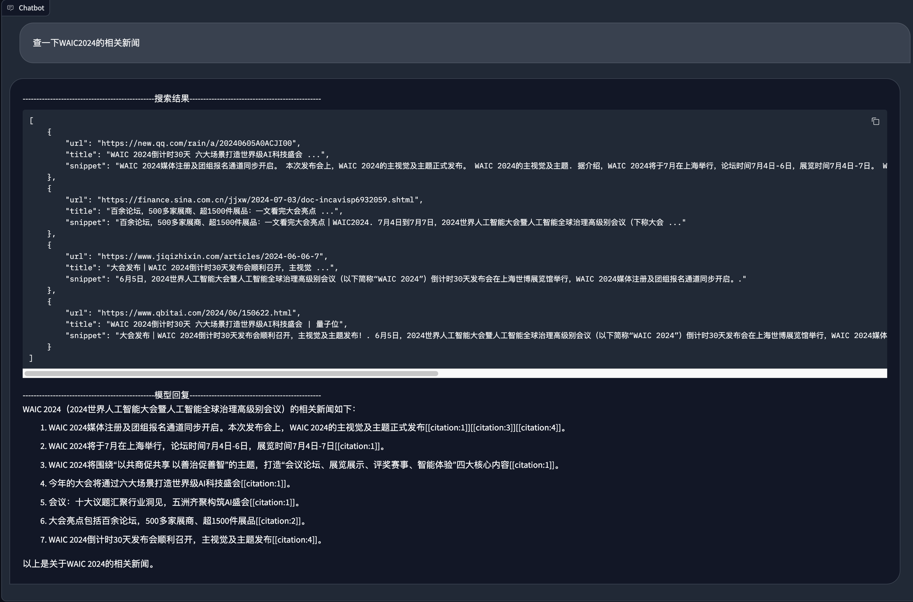

[English](README.md) | [中文](README_zh.md)

## 联网功能

CodeGeeX4支持联网搜索问答，通过调用Bing API获取搜索结果，可获取最新资讯。

## 使用教程

### 1. 安装依赖项

```bash
pip install -r requirements.txt
```

### 2. 配置Bing API Key

在`backend/apis/bing.py`中配置`BING_API_KEY`

详情可参考 [必应搜索API](https://learn.microsoft.com/zh-cn/previous-versions/azure/cognitive-services/Bing-Web-Search/bing-api-comparison)

### 3. 运行项目

```bash
python main.py

>>> Running on local URL:  http://127.0.0.1:8080
```

## Demo

